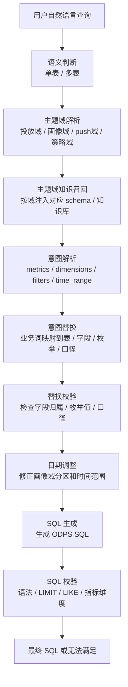
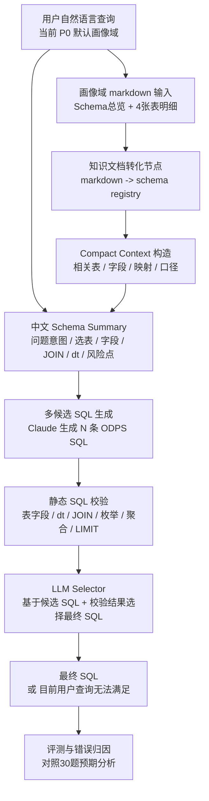
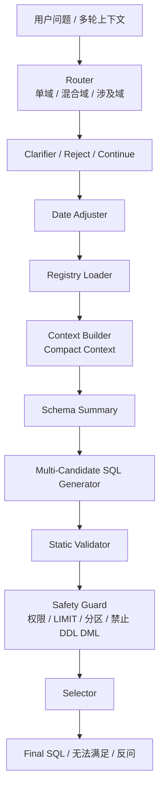

# 画像域 Text2SQL Agent PRD

## 1. 背景

当前项目最初基于 ReFoRCE Text2SQL 框架做本地调试。现在目标切换为：在一个用户画像业务评测集上，对现有 Text2SQL 链路进行适配和优化。

线上业务数据分为多个主题域，包括画像域、投放域、push 域、策略域等。线上链路通常先识别用户问题所属主题域，再召回该主题域的知识库和表结构，随后完成意图解析、字段映射、SQL 生成和 SQL 校验。

为降低调试复杂度，当前阶段只聚焦画像域。画像域由 4 张 ADM 用户画像表组成，评测集包含 30 条自然语言查询，覆盖简单、中等、困难三档。

截至 2026-05-07，仓库中已补充画像域、投放域、push 域的业务表结构原始文档。V1.0 已完成画像域单域 baseline；投放域和 push 域先作为 V1.2 多域路由与多域 schema registry 的输入储备。V1.1 开始做线上化工程重构，不再继续在旧 ReFoRCE / Spider 榜单框架上堆功能。

## 2. 当前任务目标

短期目标不是继续优化 Spider2 / OmniSQL 数据集，而是构建一条可在业务评测集上迭代，并最终贴近线上链路的 Text2SQL agent。

V1.0 已做到：

1. 读取画像域评测集和画像域 schema 文档。
2. 基于画像域业务知识生成 ODPS / MaxCompute SQL。
3. 重点提升业务语义映射正确性，包括表选择、字段选择、枚举值映射、指标口径、JOIN 方式和分区规则。
4. 在没有真实数据的情况下，先通过静态 SQL 校验和 LLM selector 评估 SQL 质量。
5. 保留 ReFoRCE compact context / schema summary 思想：生成前压缩 schema / 业务上下文，生成后候选 SQL 选择与校验。

V1.1 需要做到：

1. 隔离 Spider / ReFoRCE 公开榜单相关代码，避免干扰线上工程开发。
2. 建立线上化 pipeline：router、clarifier、date_adjuster、context_builder、schema_summary、sql_generator、validator、safety_guard、selector。
3. 每个 LLM 节点独立配置模型，前期默认大模型 Claude、小模型 `moonshot-v1-128k`，后续支持替换为单独训练的节点模型。
4. 保留线上“日期调整”环节，放在多候选 SQL 生成之前。
5. 保留无法满足、安全限制、LIMIT、分区、权限校验等线上兜底。
6. 增加 mock online data 目录和执行器入口，为后续可执行评测做准备。

当前 V1.1 已完成线上化骨架，入口为：

```bash
python3 run_online_agent.py --limit 1 --no-selector
```

新入口优先服务团队测试和线上链路调试。V1.2 已接入基于多域 registry 的 LLM router、多域 context builder 和通用 SQL 生成链路。V1.1/V1.2 不做重型字段归属解析，工程侧只保留基础安全保障和字段幻觉硬保护；复杂业务语义优先通过模型能力和知识库质量解决。

## 3. 现有文档

画像域业务文档当前采用新的文件组织方式。原始合并文件和拆分后的 markdown 均保留在 `data/` 下，拆分脚本为：

- `data/split_md.py`

当前画像域输入文件：

- `data/文档二_画像域Text2SQL评测集.md`
- `data/画像域表合并/`

后续域输入文件：

- `data/投放域表合并/`
- `data/push域表合并/`

核心文档如下：

| 文档 | 作用 |
| --- | --- |
| `text2sql线上链路.md` | 介绍当前线上 Text2SQL 链路，包括语义判断、主题域解析、意图解析、意图替换、日期调整、SQL 生成、SQL 校验等节点，以及线上 prompt 示例。 |
| `文档二_画像域Text2SQL评测集.md` | 画像域 30 条评测集，包含难度、问题、语义映射分析、选表分析、SQL 复杂度分析。 |
| `画像域表合并/画像域_01_Schema总览.md` | 画像域整体说明，包含 4 张表清单、表关联关系、选表规则、指标口径、业务术语映射、核心字段速查、SQL 示例和注意事项。 |
| `画像域表合并/画像域_02_adm_asap_base_user_label_dd.md` | 用户基础画像表明细，覆盖用户状态、年龄、性别、港漂、认证、设备、LBS、生命周期、价值、风控等字段。 |
| `画像域表合并/画像域_03_adm_asap_algo_user_label_dd.md` | 用户行为偏好表明细，覆盖权益偏好、业务偏好、eM+ 潜客、基金潜客、回流潜力、沉默风险等字段。 |
| `画像域表合并/画像域_04_adm_asap_pay_user_label_dd.md` | 用户交易行为表明细，覆盖交易金额、交易笔数、绑卡、充值、交易场景、出行、理财等字段。 |
| `画像域表合并/画像域_05_adm_asap_other_action_user_label_dd.md` | 用户非交易行为表明细，覆盖登录、活跃、领券、核销、push 互动、页面点击、商户关注等字段。 |

文档中的语雀链接暂时忽略，不作为当前 agent 输入来源。

线上实际任务提供的知识输入就是上述画像域 markdown 文档，尤其是 `data/画像域表合并/画像域_01_Schema总览.md` 到 `画像域_05_adm_asap_other_action_user_label_dd.md`。因此，结构化 schema registry 是系统链路里的自动转化产物，不要求业务同学额外维护一份 JSON 或数据库形式的知识库。

`data/profile_eval/` 是由历史画像域构建脚本从原始 markdown 生成的中间资产，而不是人工维护来源。当前重建结果为：30 条评测、4 张画像域表、301 个字段、61 条业务术语映射、30 条指标口径、0 个未解析字段引用。

## 4. 线上链路理解

当前线上链路大致为：



当前链路特点：

1. 多节点串联，每个节点有独立 LLM prompt 或规则逻辑。
2. 前置节点承担大量业务知识映射，例如主题域、字段、枚举值、指标口径、时间范围。
3. SQL 生成节点要求生成 ODPS SQL，并遵守分区裁剪、JOIN 子查询、LIMIT、LIKE 等规则。
4. 现有 prompt 偏线上生产链路，规则多、上下文长，容易出现维护成本高和信息污染。
5. 画像域表结构较清晰，适合先做单域 agent baseline。

## 5. 画像域数据理解

画像域当前包含 4 张日分区 ADM 表：

| 表 | 完整路径 | 主要能力 |
| --- | --- | --- |
| `adm_asap_base_user_label_dd` | `antsg_asap.adm_asap_base_user_label_dd` | 用户基础画像：状态、年龄、性别、港漂、认证、设备、LBS、生命周期、价值、风控。 |
| `adm_asap_algo_user_label_dd` | `anthk_sg.adm_asap_algo_user_label_dd` | 用户偏好和算法标签：权益偏好、业务偏好、eM+ 潜客、基金潜客、回流潜力、沉默风险。 |
| `adm_asap_pay_user_label_dd` | `antsg_asap.adm_asap_pay_user_label_dd` | 交易行为：交易金额、交易笔数、绑卡、充值、交易场景、理财等。 |
| `adm_asap_other_action_user_label_dd` | `antsg_asap.adm_asap_other_action_user_label_dd` | 非交易行为：登录、活跃、领券、核销、push 互动、页面点击、商户关注。 |

核心规则：

1. 所有表都有 `dt` 分区，格式为 `yyyyMMdd`。
2. 4 张表通过 `user_id + dt` 关联，关系近似 1:1。
3. 优先单表查询，只有用户问题需要跨表字段组合时才 JOIN。
4. 多表 JOIN 时，应先在每张表子查询中完成 `dt` 和业务条件过滤，再按 `user_id + dt` JOIN。
5. 用户数默认使用 `COUNT(DISTINCT user_id)`。
6. 画像域 `_dd` 表短期默认使用 `dt = max_pt('完整表名')`，除非评测或输入明确要求固定业务日期。
7. 常见业务词必须按文档映射，例如：
   - 港漂用户 -> `is_hk_drifter = 'CX'`
   - 永久居民 / 本地用户 -> `is_hk_drifter = 'AX'`
   - 高价值用户 -> `user_value LIKE '1%'`
   - 低价值用户 -> `user_value LIKE '8%'`
   - 新手期 -> `life_cycle = '1'`
   - 成长期 -> `life_cycle = '2'`
   - 沉默期 -> `life_cycle = '5'`
   - eM+ 高潜 -> `em_potential_segment = '高潜'`
   - 基金高潜 -> `fund_potential_segment = '高潜'`
   - 沉默风险高 -> `silence_risk_level = 'high'`

## 6. 技术方案

### 6.1 总体策略

V1.0 采用 ReFoRCE 短期框架，改造成画像域业务版本：



现阶段不追求完整执行反馈闭环，因为当前只有表结构和业务评测集，没有真实数据。

当前本地调试使用 `simpleai` 调 Claude，模型为 `claude-opus-4-6`。已跑过 30 条 baseline，原始报告为 `pass 9 / fail 21`；重建新 registry 并补齐通用 `user_id` 后，对同一批 SQL 重新静态校验为 `pass 13 / warning 7 / fail 10`。这个数字主要反映当前静态链路成熟度，不等同于最终业务准确率。

V1.1 起目标架构调整为线上 pipeline：



每个 LLM 节点必须独立配置模型。调试阶段推荐：router、clarifier、date_adjuster、schema_summary、llm_validator 使用 Kimi；sql_generator、selector 使用 Claude。该分工只作为默认配置，代码层面通过节点名取模型，不写死供应商或模型。

### 6.1.1 V1.1 工程边界

V1.1 不再继续复用 Spider2 / Snow / Lite / OmniSQL 的运行入口。旧代码应进入 legacy 隔离区，新线上代码应拥有独立目录和配置。

V1.1 需要预留 mock online data：

```text
data/mock_warehouse/
  profile/
  marketing/
  push/
```

mock 数据用于验证 SQL 语法、JOIN、分区、LIMIT、聚合结果形态和 selector 执行信号，不作为真实业务准确率指标。

### 6.2 数据输入

需要新增画像域任务输入格式，建议为 JSON / JSONL：

```json
{
  "id": "U001",
  "domain": "画像域",
  "difficulty": "简单",
  "question": "昨天iOS和安卓的用户各有多少",
  "expected_analysis": {
    "semantic": "...",
    "tables": "...",
    "sql_complexity": "..."
  }
}
```

`expected_analysis` 只用于评测和错误分析，不应直接注入 SQL 生成 prompt。

### 6.3 知识文档转化与上下文构造

线上输入保持为业务 markdown。系统需要增加一个“知识文档转化节点”，负责从画像域 markdown 中抽取结构化 schema registry，再基于 registry 构造 prompt 所需上下文。

这个节点的目标是：

1. 不改变业务同学的文档维护方式，业务侧继续维护 markdown。
2. 在工程链路中自动抽取表、字段、类型、值域、指标口径、业务词映射、JOIN 规则和 SQL 示例。
3. 为后续 schema summary、SQL 生成、静态校验提供统一知识源。
4. 保留抽取来源，记录每条结构化知识来自哪个 markdown 文件和章节，方便追溯。

从 schema registry 中构造两类上下文：

1. 全局画像域规则上下文：4 表简介、JOIN 规则、dt 规则、常见指标口径、业务术语映射。
2. 表级字段上下文：每张表的字段名、中文名、类型、值域、关键注意事项。

短期可以先使用规则解析 + 少量 LLM 辅助抽取。若抽取失败，可回退到 markdown 原文片段，但主链路目标仍是让 schema registry 成为统一知识中间层，避免每次都把全文注入 prompt。

当前 P0 规则解析器已适配新路径：

```bash
python3 profile_build_assets.py
```

默认读取：

- `data/文档二_画像域Text2SQL评测集.md`
- `data/画像域表合并/`

并输出到：

- `data/profile_eval/`

### 6.4 中文 Schema Summary Prompt

目标不是直接生成 SQL，而是压缩业务上下文，输出：

```text
[问题意图]
[应使用表]
[相关字段]
[业务词映射]
[指标口径]
[JOIN 方案]
[时间与分区]
[SQL 结构建议]
[风险点]
```

这个节点要重点解决：

1. 业务词到字段和值的映射。
2. 单表 / 多表判断。
3. JOIN key 和分区规则。
4. 聚合粒度和返回形态。

### 6.5 中文 SQL Generation Prompt

SQL 生成 prompt 必须面向业务同学可维护，使用中文写法。

核心要求：

1. 只基于画像域文档提供的表、字段、枚举值和口径生成 SQL。
2. 不允许编造字段、枚举值、表名。
3. 无法满足时返回 `目前用户查询无法满足：原因`。
4. 输出 ODPS / MaxCompute SQL，不输出 Markdown 或解释。
5. 所有表必须加 `dt` 分区。
6. 用户数使用 `COUNT(DISTINCT user_id)`。
7. 多表 JOIN 使用 `user_id + dt`。
8. 多表 JOIN 时每张表先做子查询过滤和列裁剪。

### 6.6 静态 SQL 校验

没有真实数据时，优先做静态校验，而不是 mock 执行。

静态校验应覆盖：

1. 表名是否属于画像域 4 张表。
2. 字段是否存在于对应表。
3. 是否存在 `dt` 分区过滤。
4. 多表 JOIN 是否包含 `user_id` 和 `dt`。
5. 用户数是否使用 `COUNT(DISTINCT user_id)`。
6. 是否误用字段归属，例如把偏好字段写到 base 表。
7. 是否伪造枚举值。
8. 是否符合 topN / ORDER BY / LIMIT 规则。
9. 无法满足时是否给出合理原因。

当前已知不足：

1. 对 CTE / 派生表 / 子查询别名的解析仍较弱，会把合法 CTE 名误判为未知表。
2. 对复杂 JOIN 中 `dt` 条件是否已在 CTE 内过滤的识别仍偏保守。
3. 当模型输出空 SQL 或只输出解释时，当前链路需要更明确的抽取失败保护和候选回退。

### 6.7 Selector

由于没有执行结果，selector 不比较 CSV，而是比较：

1. 用户问题。
2. schema summary。
3. 候选 SQL。
4. 静态校验结果。
5. 候选之间的业务语义差异。

selector 输出：

```text
[selected_sql]
候选文件名

[reason]
选择理由，说明表、字段、JOIN、指标口径为何更正确
```

### 6.8 关于 mock 数据

短期不优先 mock。

原因：

1. 当前评测核心是业务语义映射和 SQL 结构，不是执行结果。
2. mock 数据容易让模型在小数据上跑通，但掩盖字段口径、枚举映射、JOIN 规则错误。
3. 没有真实分布时，mock 执行结果不能作为业务正确性指标。

后续可以增加小型 mock 数据，仅用于验证 SQL 语法、JOIN、聚合和 LIMIT 是否可执行，不作为准确率主评估依据。

## 7. 评测方案

短期评测维度：

1. 选表是否正确。
2. 字段是否正确。
3. 业务词映射是否正确。
4. 指标口径是否正确。
5. JOIN 是否正确。
6. 分区规则是否正确。
7. 聚合、GROUP BY、ORDER BY、LIMIT 是否符合问题。
8. 是否存在字段或枚举伪造。

初期可以用人工评审 + LLM judge 双轨。等静态规则稳定后，再做规则化评分。

## 8. 非目标

当前阶段暂不做：

1. 多主题域混合查询。
2. 投放域 / push 域 / 策略域适配。
3. 真实 ODPS 执行。
4. 线上 RAG 系统接入。
5. 大规模流程重构。
6. 基于 mock 数据的结果准确率评测。

## 9. 当前开放问题

1. 评测时 `dt` 应固定为某个业务日期，还是统一使用 `max_pt('完整表名')`？
2. 30 条评测集是否需要标准 SQL gold？
3. LLM judge 是否可以读取评测集中的 A/B/C 分析作为判分依据？
4. 无法满足类输出是否纳入评测，还是所有 30 条都要求生成 SQL？
5. 线上最终是否希望保留意图解析 / 替换 / 校验节点，还是用 agent pipeline 合并部分节点？
