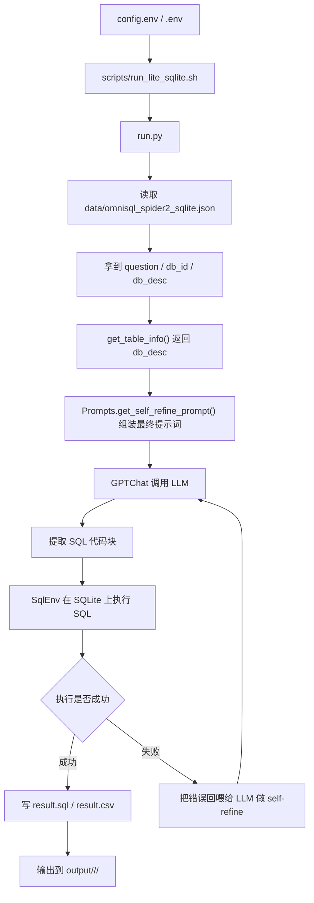
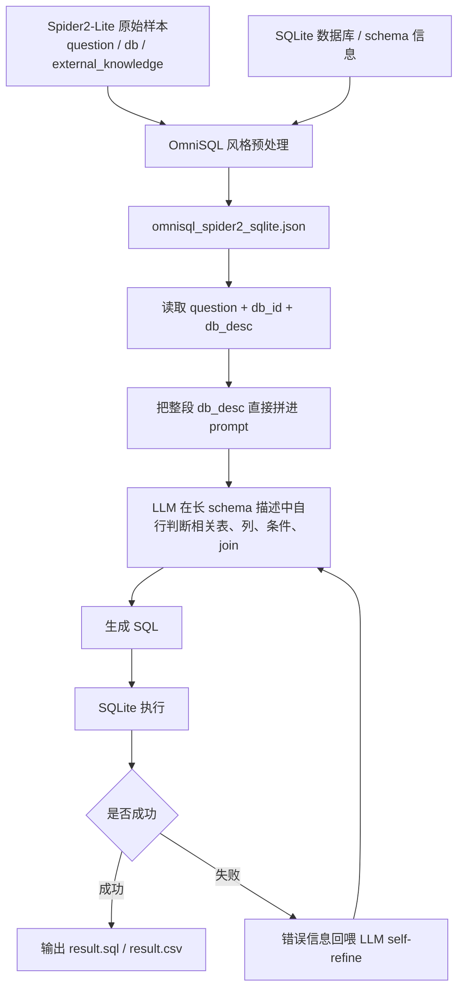

# Spider2-Lite + ReFoRCE Code Walkthrough

这份文档的目标是把当前这版代码说明白，不讨论“应该怎么改”，只回答三个问题：

1. Spider2-Lite 评测相关数据现在本地有哪些，分别在哪。
2. 这版代码从拿到问题到生成 SQL/答案，实际经过了哪些步骤。
3. 当前执行过程中有没有 mock 数据。

## 1. Spider2-Lite 评测相关数据

当前主要有两层数据来源：

- Spider2-Lite 官方数据集本体
- ReFoRCE/OmniSQL 为运行方便准备的中间格式

### 1.1 Spider2-Lite 官方目录

根目录：

- [spider2-lite](</Users/ying/Documents/老凤/text2sql/ReForce/ReFoRCE/spider2-lite>)

重要内容如下。

#### A. 样本清单

- [spider2-lite/spider2-lite.jsonl](/Users/ying/Documents/老凤/text2sql/ReForce/ReFoRCE/spider2-lite/spider2-lite.jsonl)

这里是 Spider2-Lite 的题目列表。每条样本通常包含：

- `instance_id`：样本编号，如 `local019`
- `db`：数据库名，如 `WWE`
- `question`：自然语言问题
- `external_knowledge`：如果需要额外文档，会给出文件名

例如 `local019`：

- `instance_id`: `local019`
- `db`: `WWE`
- `question`: `For the NXT title that had the shortest match...`
- `external_knowledge`: `null`

#### B. SQLite 数据库文件

- [spider2-lite/resource/databases/spider2-localdb](/Users/ying/Documents/老凤/text2sql/ReForce/ReFoRCE/spider2-lite/resource/databases/spider2-localdb)

这里放的是可执行的 SQLite 数据库文件，也就是评测真正会去查询的数据，比如：

- `WWE.sqlite`
- 其他 `*.sqlite`

这是运行 SQLite 任务时最关键的一层“真实数据”。

#### C. SQLite schema/元数据目录

- [spider2-lite/resource/databases/sqlite](/Users/ying/Documents/老凤/text2sql/ReForce/ReFoRCE/spider2-lite/resource/databases/sqlite)

这里更多是数据库的结构化资源，例如 DDL、JSON 元信息等，不一定是可直接执行的数据库。

#### D. 外部文档

- [spider2-lite/resource/documents](/Users/ying/Documents/老凤/text2sql/ReForce/ReFoRCE/spider2-lite/resource/documents)

这里是题目可能依赖的补充文档。例如函数说明、业务口径、字段定义等。

如果某个样本在 `spider2-lite.jsonl` 里有 `external_knowledge`，原始流程就可能把对应文档拷到样本目录并加入 prompt。

#### E. 评测脚本与 gold

- [spider2-lite/evaluation_suite](</Users/ying/Documents/老凤/text2sql/ReForce/ReFoRCE/spider2-lite/evaluation_suite>)
- [spider2-lite/evaluation_suite/gold](/Users/ying/Documents/老凤/text2sql/ReForce/ReFoRCE/spider2-lite/evaluation_suite/gold)

这里包含：

- 官方评测脚本
- gold SQL / gold 执行结果
- 示例提交目录

这些目录主要用于评测，不是当前生成 SQL 的核心输入。

### 1.2 ReFoRCE 当前 Lite SQLite 运行时使用的数据

当前我们跑的 SQLite 命令是：

- [scripts/run_lite_sqlite.sh](/Users/ying/Documents/老凤/text2sql/ReForce/ReFoRCE/methods/ReFoRCE/scripts/run_lite_sqlite.sh)

它会把 `run.py` 指向：

- [data/omnisql_spider2_sqlite.json](/Users/ying/Documents/老凤/text2sql/ReForce/ReFoRCE/data/omnisql_spider2_sqlite.json)

这个文件不是 Spider2-Lite 官方原始 jsonl，而是一个“运行友好”的整合格式。对每条 SQLite 样本，里面已经直接给出：

- `instance_id`
- `question`
- `db_id`
- `db_desc`

其中 `db_desc` 很重要。它是当前运行时直接喂给模型的 schema 描述，里面通常已经包含：

- `CREATE TABLE ...`
- 列名
- 列示例值

换句话说，**当前这条 Lite SQLite 路径，不是现场去库里做 schema 检索，而是直接使用 `omnisql_spider2_sqlite.json` 中准备好的 `db_desc`。**

### 1.3 `data/omnisql_spider2_sqlite.json` 是哪来的

这里要分“仓库里明确写了什么”和“从代码行为可以推断什么”。

#### 仓库里明确写了的事实

- [README.md](/Users/ying/Documents/老凤/text2sql/ReForce/ReFoRCE/README.md) 把 `data/` 描述为：
  - `OmniSQL SQLite File and Schema Linking Results`
- [data/README.md](/Users/ying/Documents/老凤/text2sql/ReForce/ReFoRCE/data/README.md) 明确写了：
  - `We follow the prompt format and evaluation script from OmniSQL.`

这说明：

1. `omnisql_spider2_sqlite.json` 不是 Spider2-Lite 官方原始发布格式。
2. 它是 **按 OmniSQL 的输入/评测格式整理出来的中间文件**。
3. 这个文件是随 ReFoRCE 仓库一起分发的运行数据。

另外，[data/README.md](/Users/ying/Documents/老凤/text2sql/ReForce/ReFoRCE/data/README.md) 还单独说明了：

- `omnisql_spider2_sqlite_OS_linked.json` 是他们应用 OpenSearchSQL 的 extraction part 生成的。

这也从侧面说明，`data/` 目录下这些 `omnisql*.json` 都属于 **ReFoRCE 仓库为了实验/运行准备的派生数据**，而不是 Spider2 官方原生文件。

#### 基于代码和目录结构的推断

我没有在仓库里看到一条逐字说明，明确写着“`omnisql_spider2_sqlite.json` 是 ReFoRCE 团队完全从头构造的”。但从目前证据看，比较稳妥的判断是：

- 它**不是** Spider2-Lite 官方原始标注文件。
- 它**是** ReFoRCE 团队（或他们直接沿用的 OmniSQL 预处理流程）整理出来的中间格式。
- 它的目标是把 Spider2-Lite 的 SQLite 子任务变成一个更方便直接喂给 LLM 的输入格式。

所以更准确的说法不是“开发团队自己凭空造了一个新 benchmark”，而是：

**他们基于 Spider2-Lite 原始样本，整理出了一份 OmniSQL 风格的派生输入文件。**

#### 为什么它看起来和 Spider2-Lite 原始任务不完全一致

这是一个很关键的观察。你说得对，当前这条路径和 Spider2-Lite 原始样本形态并不完全一致，主要有三个差别：

1. `external_knowledge` 没有显式保留下来  
   Spider2-Lite 原始样本在 [spider2-lite/spider2-lite.jsonl](/Users/ying/Documents/老凤/text2sql/ReForce/ReFoRCE/spider2-lite/spider2-lite.jsonl) 里会给 `external_knowledge` 字段，但 `omnisql_spider2_sqlite.json` 当前这条运行路径主要使用的是：
   - `question`
   - `db_id`
   - `db_desc`

   所以在我们现在实际跑的 Lite SQLite 命令里，`external_knowledge` 没有作为一等输入被显式检索和拼接。

2. “找哪些表”这一步被弱化了  
   原始 ReFoRCE 方法里有 schema linking / compression / exploration 这些模块；但当前 Lite SQLite 的这条 OmniSQL 路径，已经把大量 schema 信息预先压成了 `db_desc`，所以运行时不再显式做一次“先找相关表再拼 prompt”的检索动作。

3. 任务被改写成了“OmniSQL 风格输入”  
   也就是说，原始 benchmark 的样本定义没有变，但**运行时输入给模型的形式变了**。  
   当前不是：
   - 原始 question + 原始 schema资源 + 原始 external docs + 在线检索  
   而是：
   - 原始 question + 预构造好的 `db_desc`

所以如果站在“agent 系统设计”的角度看，当前这条链路更像是一个 **经过预处理和压缩的 Lite SQLite 子任务版本**，而不是完整复刻 Spider2-Lite 原始信息流。

#### 一个容易混淆、但很重要的边界

可以认为 ReFoRCE **复用了 OmniSQL / OpenSearchSQL 体系下的输入格式和部分 schema 处理结果**，并把这些预处理产物直接放进了仓库，方便复现实验。

但这里最好不要把所有 `omnisql*.json` 都直接等同于“schema linking 结果”，因为它们的角色并不完全一样。

更稳妥的区分是：

- `omnisql_spider2_sqlite.json`  
  更像是 **OmniSQL 风格的输入文件**。它主要提供：
  - `question`
  - `db_id`
  - `db_desc`

- `omnisql_spider2_sqlite_OS_linked.json`  
  从名字和 [data/README.md](/Users/ying/Documents/老凤/text2sql/ReForce/ReFoRCE/data/README.md) 的说明看，更接近 **OpenSearchSQL extraction / schema linking 之后的版本**

- `linked_lite_tmp0.json`  
  更接近由 [schema_linking.py](/Users/ying/Documents/老凤/text2sql/ReForce/ReFoRCE/methods/ReFoRCE/schema_linking.py) 生成的 **table-level schema linking 结果**

所以更准确的说法是：

**ReFoRCE 复用了 OmniSQL/OpenSearchSQL 侧的输入格式和部分 schema linking / extraction 产物，并把这些中间结果随仓库一起发布了；而这部分并不是 ReFoRCE 最强调的核心创新点。**

如果从系统形态来理解，这个判断很关键，因为它意味着：

**当前 Lite SQLite 路径更像一条“基于预处理输入文件的生成式链路”，而不是一个从原始 benchmark 信息在线做召回、再交给 agent 推理的完整在线系统。**

## 2. 从问题到 SQL/答案，中间有哪些过程

下面按当前实际在跑的链路来讲，也就是：

- `bash scripts/run_lite_sqlite.sh`
- `python3 run.py --task lite --subtask sqlite ...`

### 2.1 总体流程



### 2.2 入口脚本做了什么

文件：

- [scripts/run_lite_sqlite.sh](/Users/ying/Documents/老凤/text2sql/ReForce/ReFoRCE/methods/ReFoRCE/scripts/run_lite_sqlite.sh)

它的工作基本是：

1. 读取 `.env` 和 `config.env`
2. 解析模型、最大迭代次数、任务数量、输出目录等参数
3. 检查本地 SQLite 数据库目录是否存在
4. 调用 [run.py](/Users/ying/Documents/老凤/text2sql/ReForce/ReFoRCE/methods/ReFoRCE/run.py)

### 2.3 `run.py` 在 Lite SQLite 路径下做了什么

关键点在 [run.py](/Users/ying/Documents/老凤/text2sql/ReForce/ReFoRCE/methods/ReFoRCE/run.py)。

当传入：

- `--task lite`
- `--subtask sqlite`
- `--omnisql_format_pth ../../data/omnisql_spider2_sqlite.json`

时，代码会先读取 `omnisql_spider2_sqlite.json`，然后对每条样本直接设置：

- `task_dict[instance_id] = question`
- `full_tb_info[instance_id] = db_desc`
- `full_db_id[instance_id] = db_id`

也就是说：

- 问题来自 `question`
- 表结构提示来自 `db_desc`
- 执行数据库来自 `db_id -> spider2-localdb/<db_id>.sqlite`

### 2.4 `get_table_info()` 在当前版本里做了什么

文件：

- [utils.py](/Users/ying/Documents/老凤/text2sql/ReForce/ReFoRCE/methods/ReFoRCE/utils.py)

函数：

- `get_table_info(...)`

它在当前这条链路里几乎没有做检索。因为一旦 `full_tb_info` 存在，就会直接返回：

```python
return full_tb_info[sql_data]
```

也就是直接返回 `db_desc`。

所以当前这版代码在 Lite SQLite 场景下，**不是先做关键词/BM25 召回再拼 prompt**，而是直接把预制好的 schema 描述交给模型。

### 2.4.1 当前 Lite SQLite 跑法的本质：直接喂 schema 描述 + LLM 过滤

这条方法可以拆成两层来理解。

#### 第一层：直接喂 schema 描述

这里的 “schema 描述” 就是 `db_desc`。它通常已经把每个数据库整理成一大段可直接放进 prompt 的文本，内容包括：

- 表名
- 列名
- 主键/外键
- 部分列的 example 值

所以模型一上来拿到的不是“空数据库 + 需要自己检索”，而是一个已经展开过的数据库摘要。

这一步的优点是：

- 工程上很简单
- 不依赖 embedding 环境
- 不需要额外召回系统
- 对中小规模 SQLite 任务很直接

这一步的代价是：

- prompt 会比较长
- 无法显式控制只看 top-k 表/文档
- 如果 `db_desc` 没带某些关键信息，模型也不会主动再去找外部文档

#### 第二层：LLM 过滤

这里的“过滤”在当前代码里主要不是一个独立的检索模块，而是体现在 LLM 自己完成下面这些判断：

- 哪些表相关
- 哪些列相关
- 应该如何 join
- 哪些条件需要保留/忽略

如果走原始 ReFoRCE 全链路，还可能叠加：

- table-level schema linking
- column exploration
- self-refinement

但在我们现在实际跑的这条 Lite SQLite OmniSQL 路径里，最核心的仍然是：

1. 预构造 `db_desc`
2. 把整段 `db_desc` 给模型
3. 让模型自己在长 schema 描述中“筛选有用部分并生成 SQL”

所以“LLM 过滤”更准确地说，是 **把检索/筛选这部分认知负担交给模型在推理时内部完成**，而不是由一个单独的 BM25/关键词模块完成。

#### 这个方法和“关键词/BM25 召回”的区别

二者的最大区别是：

- 关键词/BM25：先由检索器挑 top-k 表/文档，再把结果给模型
- 当前方法：不做显式 top-k 检索，直接把整理后的 schema 描述交给模型，让模型自己在上下文里筛

也就是说，当前方法更接近：

- `schema-as-context`

而不是：

- `retrieve-then-read`

#### 这条方法的架构图



#### 用一句话概括这条方法

如果只用一句话概括，当前 Lite SQLite 跑法就是：

**先把数据库压成一段可读的 schema 描述，再把“筛表、筛列、组 SQL”的工作主要交给 LLM 在生成时完成。**

### 2.5 Prompt 是怎么拼出来的

文件：

- [prompt.py](/Users/ying/Documents/老凤/text2sql/ReForce/ReFoRCE/methods/ReFoRCE/prompt.py)

当前 Lite SQLite 路径里，`self_refine` 使用的是 `omni_sql_input_prompt_template`。它会把下面几项拼起来：

- `Database Engine: SQLite`
- `Database Schema: db_desc`
- `Question: question`
- 一些输出格式要求

这一步没有额外文档检索，也没有显式的 top-k 表召回。

### 2.6 LLM 调用与 SQL 提取

文件：

- [chat.py](/Users/ying/Documents/老凤/text2sql/ReForce/ReFoRCE/methods/ReFoRCE/chat.py)

当前流程会：

1. 调用模型
2. 优先从 ```sql 代码块中抽取 SQL
3. 如果模型没加代码块，但直接输出了 `SELECT ...` / `WITH ...`，也会做兜底提取

这一步还支持：

- `LLM_MAX_TOKENS`
- `THINK_OR_NOT`
- `moonshot-v1-128k` 不带 thinking 参数

### 2.7 SQL 执行与迭代修正

文件：

- [agent.py](/Users/ying/Documents/老凤/text2sql/ReForce/ReFoRCE/methods/ReFoRCE/agent.py)
- [sql.py](/Users/ying/Documents/老凤/text2sql/ReForce/ReFoRCE/methods/ReFoRCE/sql.py)

主流程在：

- `REFORCE.self_refine(...)`

做法是：

1. 让模型生成一个 SQL
2. 用 `SqlEnv.execute_sql_api(...)` 在 SQLite 上执行
3. 如果成功，写出 `result.sql` 和 `result.csv`
4. 如果失败，把错误信息拼成新的 prompt，再让模型改
5. 最多循环 `MAX_ITER` 次

这里的“答案”其实就是 SQL 执行后的 CSV 结果。

## 2.8 用 `local019` 举一个完整例子

### 样本原始信息

题目来源：

- [spider2-lite/spider2-lite.jsonl](/Users/ying/Documents/老凤/text2sql/ReForce/ReFoRCE/spider2-lite/spider2-lite.jsonl)

运行时 schema 来源：

- [data/omnisql_spider2_sqlite.json](/Users/ying/Documents/老凤/text2sql/ReForce/ReFoRCE/data/omnisql_spider2_sqlite.json)

对应样本：

- `instance_id`: `local019`
- `db_id`: `WWE`
- 问题：`For the NXT title that had the shortest match...`

数据库文件：

- [WWE.sqlite](/Users/ying/Documents/老凤/text2sql/ReForce/ReFoRCE/spider2-lite/resource/databases/spider2-localdb/WWE.sqlite)

### 这一题在当前代码里是怎么走的

1. `run.py` 读取 `local019`
2. 从 `omnisql_spider2_sqlite.json` 里拿到：
   - `question`
   - `db_desc`
   - `db_id=WWE`
3. `get_table_info()` 直接返回 `db_desc`
4. `prompt.py` 把 `db_desc + question` 拼成完整 prompt
5. `chat.py` 调 Moonshot/Kimi 生成 SQL
6. `sql.py` 在 `WWE.sqlite` 上执行
7. 成功后把 SQL 和 CSV 写到输出目录

### 这次实际跑出来的结果

输出目录：

- [local019 output](/Users/ying/Documents/老凤/text2sql/ReForce/ReFoRCE/methods/ReFoRCE/output/moonshot-v1-128k-lite-sqlite-3tasks-offset10-no-thinking-20260425-143118/local019)

生成 SQL：

- [result.sql](/Users/ying/Documents/老凤/text2sql/ReForce/ReFoRCE/methods/ReFoRCE/output/moonshot-v1-128k-lite-sqlite-3tasks-offset10-no-thinking-20260425-143118/local019/result.sql)

结果 CSV：

- [result.csv](/Users/ying/Documents/老凤/text2sql/ReForce/ReFoRCE/methods/ReFoRCE/output/moonshot-v1-128k-lite-sqlite-3tasks-offset10-no-thinking-20260425-143118/local019/result.csv)

结果内容是：

```csv
winner_name,loser_name
Sami Zayn,Dominik Mysterio
```

从 log 可以看到，当时模型收到的 prompt 里，已经包含整段 `CREATE TABLE ...` 形式的 schema 描述，而不是在线检索出来的 top-k 表。

## 3. 当前执行过程中，有没有 mock 数据

### 3.1 实际评测链路里，没有 mock 数据

对于我们现在跑的：

- `bash scripts/run_lite_sqlite.sh`

这条链路，使用的都是真实数据：

- 真实题目：`spider2-lite/spider2-lite.jsonl`
- 真实数据库：`spider2-lite/resource/databases/spider2-localdb/*.sqlite`
- 真实 schema 描述：`data/omnisql_spider2_sqlite.json` 中的 `db_desc`
- 真实模型调用：`chat.py -> LLM API`

所以**实际评测过程本身没有 mock 数据参与**。

### 3.2 但项目里确实存在“演示/样例/mock”内容

有几个地方容易和正式流程混淆：

#### A. 本地 demo 的 mock 模式

- [run_local_demo.py](/Users/ying/Documents/老凤/text2sql/ReForce/ReFoRCE/methods/ReFoRCE/run_local_demo.py)

这里有：

- `--mock`

它是我为了做最小闭环验证加的，作用是不用真实 LLM，直接返回一个确定性的本地结果。这个只用于 demo，不参与正式 Lite benchmark。

#### B. `db_desc` 里的 example 值 / sample rows

像：

- `id INTEGER, -- example: [1, 230, 3211]`

这类内容不是 mock 数据，它只是**从真实库中抽取出来的示例值**，用于帮助模型理解字段语义。

#### C. `evaluation_suite/example_submission_folder`

- [spider2-lite/evaluation_suite/example_submission_folder](/Users/ying/Documents/老凤/text2sql/ReForce/ReFoRCE/spider2-lite/evaluation_suite/example_submission_folder)

这里是示例提交，不是当前推理流程的输入。

## 4. 当前代码最值得记住的结论

如果只记住三件事，建议记这三条：

1. 当前 Lite SQLite 路径的 schema 来源是 [data/omnisql_spider2_sqlite.json](/Users/ying/Documents/老凤/text2sql/ReForce/ReFoRCE/data/omnisql_spider2_sqlite.json) 里的 `db_desc`，不是动态召回。
2. 当前“答案”本质上是 SQL 在真实 SQLite 上执行后的 CSV 结果。
3. 现在正式评测链路没有 mock；mock 只存在于额外加的本地 demo 工具里。
